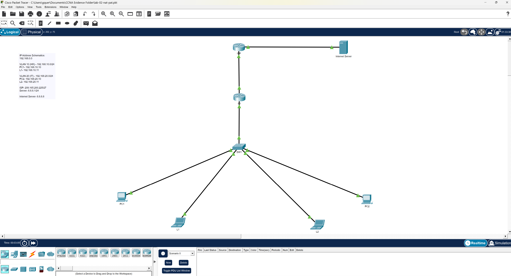

# LAB-02-NAT-PAT

## Overview

This lab demonstrates the implementation and troubleshooting of NAT/PAT in a simulated enterprise network environment using Cisco Packet Tracer.

The lab integrates:
- VLAN segmentation
- Router-on-a-Stick inter-VLAN routing
- WAN edge routing
- PAT overload
- ACL-based NAT translation
- ISP simulation
- External DNS server connectivity

---

# Objectives

- Configure VLANs and trunking
- Implement inter-VLAN routing
- Configure PAT overload
- Configure static routing
- Verify external connectivity
- Troubleshoot NAT directionality issues

---

# Technologies Used

- Cisco Packet Tracer
- Cisco IOS CLI
- VLANs
- 802.1Q Trunking
- Router-on-a-Stick
- NAT
- PAT Overload
- Static Routing
- ACLs

---

# Network Topology




## Internal VLANs

| VLAN | Department | Network |
|---|---|---|
| 10 | HR | 192.168.10.0/24 |
| 20 | IT | 192.168.20.0/24 |

---

# WAN Network

| Device | Interface | IP Address |
|---|---|---|
| R1 | G0/0 | 209.165.200.226/27 |
| ISP | G0/0 | 209.165.200.225/27 |

---

# External Server

| Device | IP Address |
|---|---|
| DNS Server | 8.8.8.8 |

---

# Key Configurations

## PAT Overload

```cisco
ip nat inside source list 1 interface GigabitEthernet0/0 overload
```

---

## Default Route

```cisco
ip route 0.0.0.0 0.0.0.0 209.165.200.225
```

---

# Verification Commands

```cisco
show vlan brief
show interfaces trunk
show ip route
show ip nat statistics
show ip nat translations
show access-lists
```

---

# Troubleshooting Highlights

During the lab, troubleshooting focused heavily on:
- NAT inside/outside direction
- WAN interface assignment
- ACL matching
- Interface operational states
- Packet Tracer NAT behavior

---

# Skills Demonstrated

- Enterprise network troubleshooting
- VLAN implementation
- Inter-VLAN routing
- WAN edge configuration
- NAT/PAT deployment
- Cisco CLI navigation
- Layered troubleshooting methodology

---

# Evidence

The evidence folder contains:
- topology screenshots
- switch configuration verification
- NAT troubleshooting process
- routing verification
- successful PAT translations
- external connectivity validation

---

# Final Result

The final environment successfully:
- routed traffic between VLANs
- translated private addresses using PAT
- simulated internet access through an ISP router
- verified external connectivity to a DNS server