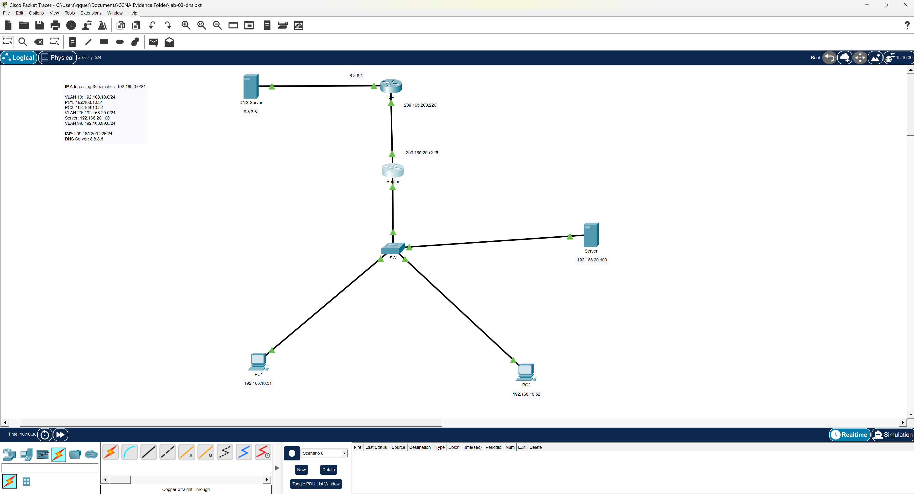

# Lab 03 - Enterprise DNS Services

## Overview

This lab focused on deploying a small enterprise-style network infrastructure using VLAN segmentation, Router-on-a-Stick inter-VLAN routing, DHCP, DNS, HTTP services, and NAT/PAT for simulated internet connectivity.

The goal of this lab was to combine multiple previously learned networking concepts into a single integrated environment to simulate a realistic branch-office network.

---

# Objectives

- Configure VLAN segmentation
- Configure trunk links between switch and router
- Implement Router-on-a-Stick inter-VLAN routing
- Configure DHCP services for client devices
- Configure DNS services for internal hostname resolution
- Configure HTTP services for internal web access
- Configure NAT/PAT for internet connectivity
- Validate internal and external network communication
- Practice layered troubleshooting methodologies

---

# Technologies Used

- Cisco Packet Tracer
- VLANs
- 802.1Q Trunking
- Router-on-a-Stick (ROAS)
- DHCP
- DNS
- HTTP
- NAT/PAT
- Static Default Routing
- Inter-VLAN Routing

---

# Enterprise Concepts Simulated

- Internal user VLAN segmentation
- Dedicated server VLAN
- Router-on-a-Stick inter-VLAN routing
- DHCP address automation
- Internal DNS hostname resolution
- HTTP internal service hosting
- NAT/PAT internet edge translation
- WAN ISP simulation

---

# Network Topology



## VLAN Structure

| VLAN | Name | Subnet |
|------|------|------|
| 10 | USERS | 192.168.10.0/24 |
| 20 | SERVERS | 192.168.20.0/24 |
| 99 | MGMT | 192.168.99.0/24 |

---

# Device Addressing

| Device | Interface | IP Address |
|------|------|------|
| R1 | G0/1.10 | 192.168.10.1 |
| R1 | G0/1.20 | 192.168.20.1 |
| R1 | G0/1.99 | 192.168.99.1 |
| R1 | G0/0 | 209.165.200.225 |
| ISP Router | G0/0 | 209.165.200.226 |
| Server | NIC | 192.168.20.100 |
| SW1 VLAN99 | VLAN 99 | 192.168.99.2 |

---

# Key Configurations

## Switch Configuration

- VLAN creation
- Access port assignments
- Trunk configuration
- Management VLAN configuration

## Router Configuration

- Router-on-a-Stick subinterfaces
- DHCP pools
- NAT/PAT overload
- Default route
- Inter-VLAN routing

## Server Configuration

- DNS service enabled
- HTTP service enabled
- Internal DNS record configured

### DNS Record

| Hostname | IP Address |
|------|------|
| www.smartech.local | 192.168.20.100 |

---

# Validation Tests

## DHCP Validation

- PCs successfully received:
  - IP addresses
  - Default gateway
  - DNS server information

## Connectivity Validation

Successful tests included:

- Internal VLAN communication
- Inter-VLAN routing
- Internet simulation connectivity
- NAT translation generation

## DNS Validation

Successful hostname resolution:

```bash
nslookup www.smartech.local
```

## HTTP Validation

Successfully accessed:

http://www.smartech.local

through internal DNS resolution.

---

# Troubleshooting Performed

Several troubleshooting steps were required throughout this lab:

- Corrected Router-on-a-Stick interface architecture
- Removed overlapping IP assignment from physical interface
- Fixed DHCP configuration scope issues
- Corrected Cisco IOS configuration mode usage
- Verified VLAN trunk operation
- Validated NAT inside/outside interface assignments
- Troubleshot DNS service initialization behavior

---

# Skills Reinforced

- Enterprise network segmentation
- Infrastructure service integration
- Cisco IOS troubleshooting
- Multi-service dependency analysis
- Layered troubleshooting methodology
- Real-world network design logic

---

# Files Included

## Configurations

- r1-config.txt
- sw1-config.txt
- server-config.txt

## Documentation

- lab-notes.md
- troubleshooting-notes.md

## Evidence

Contains:
- VLAN verification
- NAT verification
- DHCP validation
- DNS validation
- HTTP testing
- topology screenshots
- troubleshooting screenshots

---

# Lessons Learned

This lab reinforced the importance of understanding how multiple enterprise networking technologies interact together rather than viewing each service as an isolated configuration task.

The troubleshooting process highlighted how routing, VLANs, DHCP, DNS, and NAT all depend on proper lower-layer functionality to operate successfully.